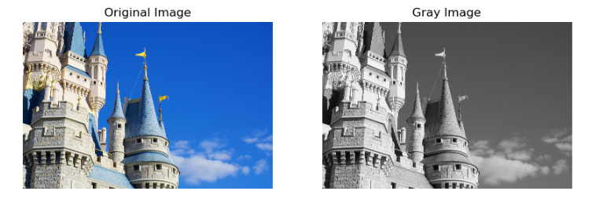
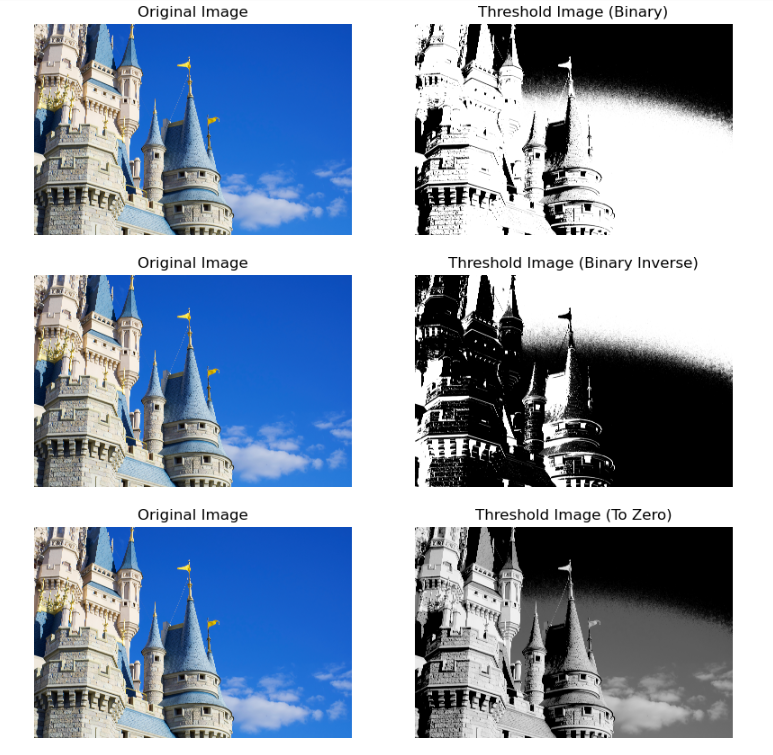
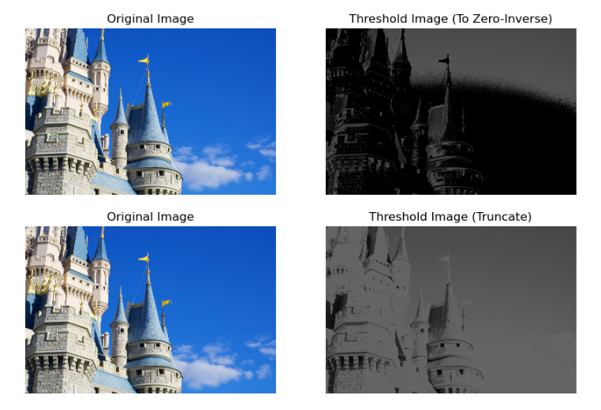
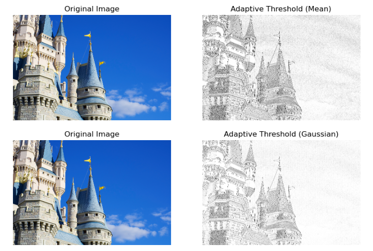
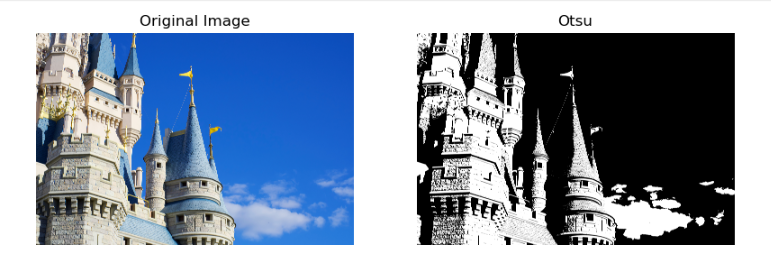

# THRESHOLDING
## AIM
To segment the image using global thresholding, adaptive thresholding and Otsu's thresholding using python and OpenCV.

## SOFTWARE REQUIRED
1. Anaconda - Python 3.7
2. OpenCV

## ALGORITHM

### Step1:
Load the necessary packages.
<br>

### Step2:
Read the Image and convert to grayscale.
<br>

### Step3:
Use Global thresholding to segment the image.
<br>

### Step4:
Use Adaptive thresholding to segment the image.
<br>

### Step5:
Use Otsu's method to segment the image.
<br>

### Step6:
Display the results.
<br>
<br>

## PROGRAM

Developed by: SNEHA BASYAL M

Register No: 212222240101

## Load the necessary packages
```
import numpy as np
import matplotlib.pyplot as plt
import cv2
```

## Read the Image and convert to grayscale
```
image = cv2.imread("disney.jpg",1)
image = cv2.cvtColor(image,cv2.COLOR_BGR2RGB)
image_gray = cv2.imread("disney.jpg",0)
```

## Use Global thresholding to segment the image
```
ret,thresh_img1=cv2.threshold(image_gray,86,255,cv2.THRESH_BINARY)
ret,thresh_img2=cv2.threshold(image_gray,86,255,cv2.THRESH_BINARY_INV)
ret,thresh_img3=cv2.threshold(image_gray,86,255,cv2.THRESH_TOZERO)
ret,thresh_img4=cv2.threshold(image_gray,86,255,cv2.THRESH_TOZERO_INV)
ret,thresh_img5=cv2.threshold(image_gray,100,255,cv2.THRESH_TRUNC)
```

## Use Adaptive thresholding to segment the image
```
thresh_img7=cv2.adaptiveThreshold(image_gray,255,cv2.ADAPTIVE_THRESH_MEAN_C,cv2.THRESH_BINARY,11,2)
thresh_img8=cv2.adaptiveThreshold(image_gray,255,cv2.ADAPTIVE_THRESH_GAUSSIAN_C,cv2.THRESH_BINARY,11,2)
```

## Use Otsu's method to segment the image 
```
ret,thresh_img6=cv2.threshold(image_gray,0,255,cv2.THRESH_BINARY+cv2.THRESH_OTSU)
```

## Display the results
```
titles=["Gray Image","Threshold Image (Binary)","Threshold Image (Binary Inverse)","Threshold Image (To Zero)"
       ,"Threshold Image (To Zero-Inverse)","Threshold Image (Truncate)","Otsu","Adaptive Threshold (Mean)","Adaptive Threshold (Gaussian)"]
images=[image_gray,thresh_img1,thresh_img2,thresh_img3,thresh_img4,thresh_img5,thresh_img6,thresh_img7,thresh_img8]
for i in range(0,9):
    plt.figure(figsize=(10,10))
    plt.subplot(1,2,1)
    plt.title("Original Image")
    plt.imshow(image)
    plt.axis("off")
    plt.subplot(1,2,2)
    plt.title(titles[i])
    plt.imshow(cv2.cvtColor(images[i],cv2.COLOR_BGR2RGB))
    plt.axis("off")
    plt.show()
```

## OUTPUT:

## Original Image

<br>
<br>
<br>
<br>
<br>

## Global Thresholding


<br>
<br>
<br>
<br>
<br>

## Adaptive Thresholding

<br>
<br>
<br>
<br>
<br>

## Optimum Global Thesholding using Otsu's Method

<br>
<br>
<br>
<br>

## Result
Thus the images are segmented using global thresholding, adaptive thresholding and optimum global thresholding using python and OpenCV.

